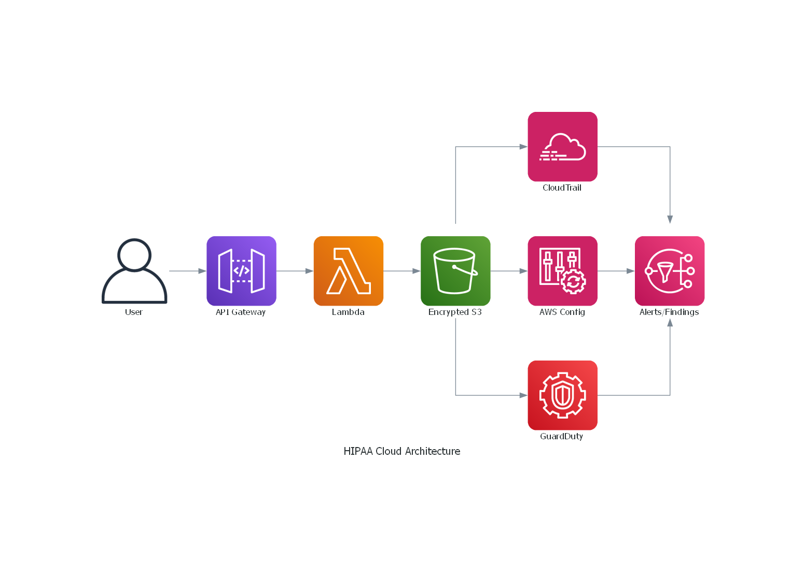
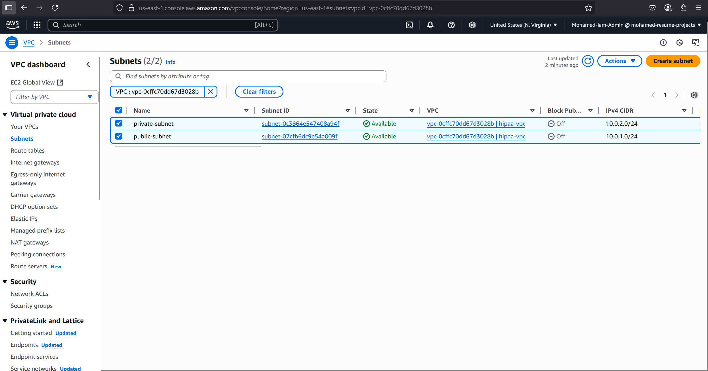
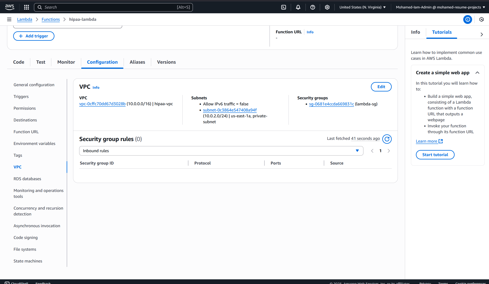
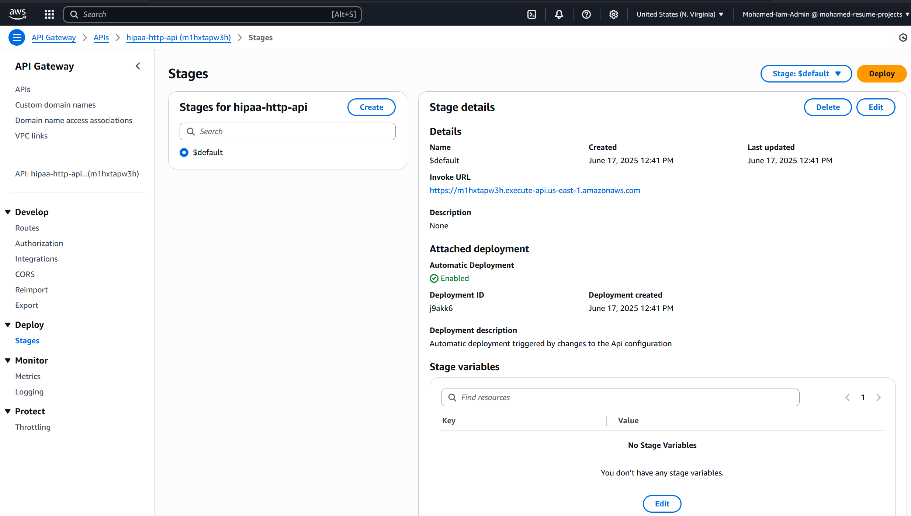
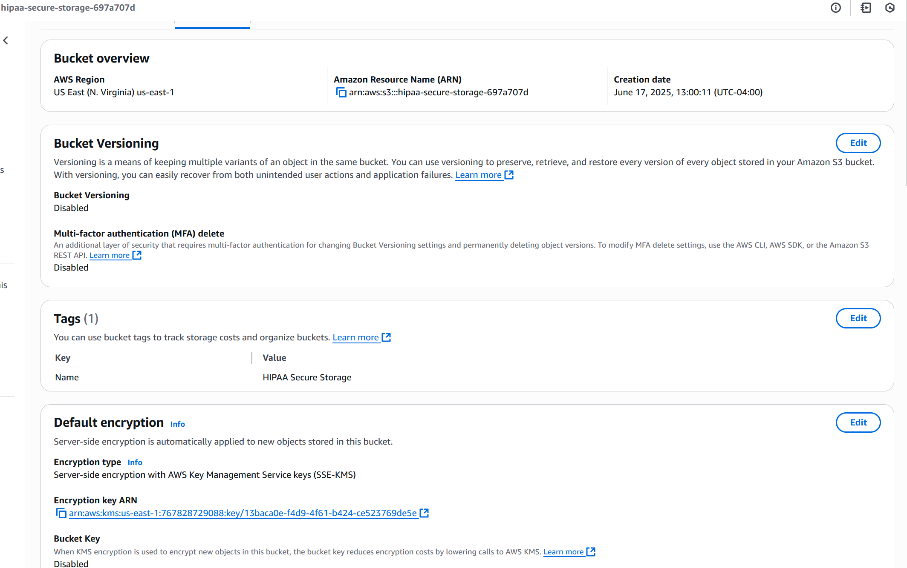
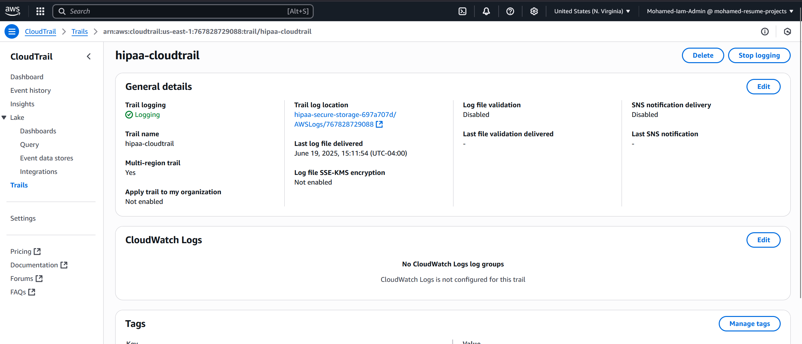
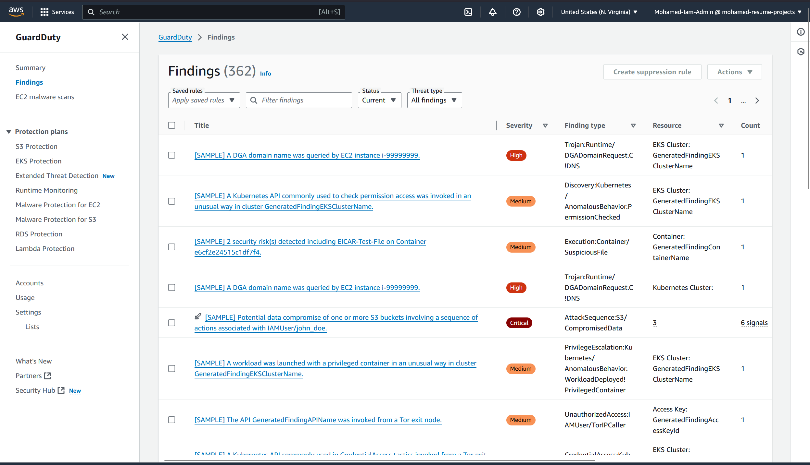
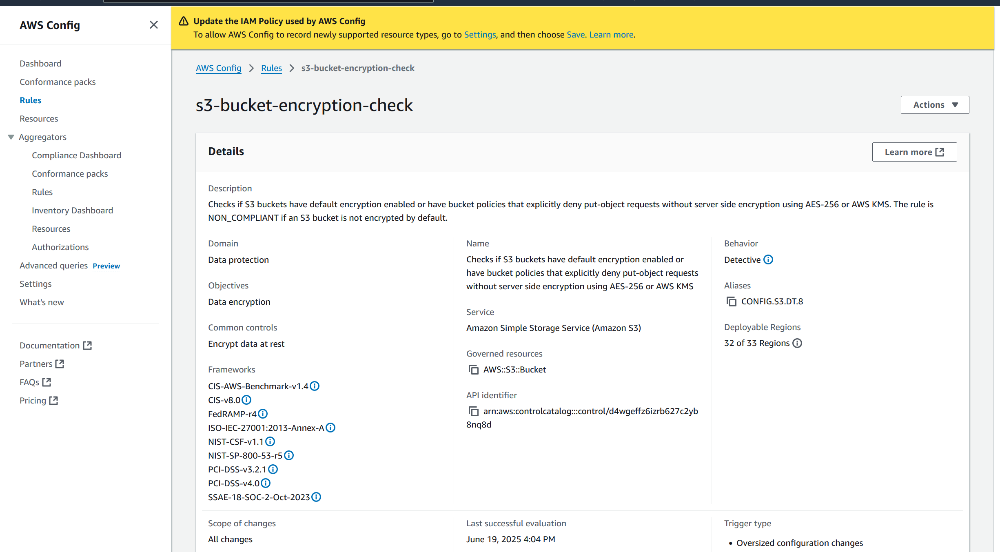

# 🛡️ HIPAA-Compliant Serverless Cloud Infrastructure on AWS

This project demonstrates a fully automated, secure, and compliance-aligned healthcare application infrastructure on AWS, using **Terraform**, **Lambda**, **API Gateway**, and **AWS-native security services**. It's purpose-built to meet **HIPAA**, **NIST 800-53**, and **CIS Benchmark** standards.

---

## 📊 Architecture Diagram



---

## ☁️ Cloud Infrastructure Components

| Layer      | Tool          | Purpose                          |
| ---------- | ------------- | -------------------------------- |
| Networking | VPC + Subnets | Isolate Lambda in private subnet |
| Compute    | Lambda        | Stateless backend function       |
| Gateway    | API Gateway   | HTTPS access to Lambda           |
| Storage    | S3 + KMS      | Encrypted data storage           |
| IAM        | Custom roles  | Enforce least privilege          |
| Monitoring | CloudTrail    | Log every API call               |
| Detection  | GuardDuty     | Threat detection                 |
| Auditing   | AWS Config    | Real-time compliance rules       |

---

## 📊 Business & Technical Impact

### 1. 🚀 Driving Operational Efficiency and Cost Savings

* Fully serverless and pay-per-use: no EC2 or container overhead.
* Automated deployments via Terraform reduce manual misconfigurations.

### 2. ⚙️ Enabling Innovation and Agility

* Uses modern cloud-native services (Lambda + API Gateway) for rapid iteration.
* Infrastructure as code enables faster experimentation and safe rollbacks.

### 3. 🔐 Ensuring Robust Security and Compliance

* Enforced least privilege IAM, encrypted storage (KMS), and audit logging.
* Automated compliance monitoring with AWS Config and GuardDuty.

### 4. 📈 Enhancing Scalability and Flexibility

* Stateless compute (Lambda) scales on demand.
* Modular infrastructure for easy integration into enterprise environments.

### 5. 💼 Demonstrating Business Acumen

* Aligns cloud infrastructure with regulatory requirements and risk management.
* Maps each AWS service to real-world compliance controls (HIPAA §164.312, NIST AU-2/SI-4).

---

## 🖼️ Infrastructure Screenshots

### 🔐 VPC Private Subnet



### ⚙️ Lambda in Private Subnet 



### 🌐 API Gateway (HTTPS Endpoint)



### 🔐 S3 Bucket Encryption + Access Block



### 📜 CloudTrail Logging Enabled



### 🛡️ GuardDuty Findings (Simulated)



### 📋 AWS Config Rule – S3 Encryption



---

## ✅ Compliance Mapping (HIPAA & NIST)

| AWS Service  | HIPAA Control                       | NIST 800-53  |
| ------------ | ----------------------------------- | ------------ |
| CloudTrail   | §164.312(b) - Audit Controls        | AU-2, AU-12  |
| S3 + KMS     | §164.312(c) - Integrity             | SC-12, SC-13 |
| Lambda + IAM | §164.308(a)(3) - Workforce Security | AC-2, AC-6   |
| GuardDuty    | §164.308(a)(1) - Risk Mgmt          | SI-4         |
| AWS Config   | §164.308(a)(8) - Evaluation         | CA-7         |

---

## 🧪 Simulated Threat Detection

To validate security tooling:

```bash
aws guardduty create-sample-findings --detector-id <your-id>
```

→ Triggers realistic, harmless threat alerts for audit testing.

---

## ⚙️ Terraform Commands

```bash
terraform init
terraform apply
terraform destroy
```

---

## 🧹 Clean-Up

Be sure to destroy all resources to avoid charges:

```bash
terraform destroy
```

---

## 🧠 Author's Note

This project showcases not only DevSecOps capabilities, but also how to translate **cloud engineering into business outcomes** — security, agility, and compliance at scale.
